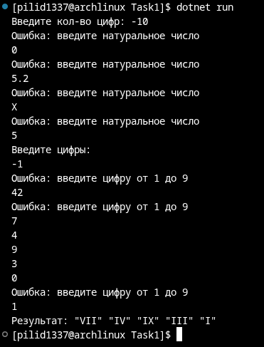
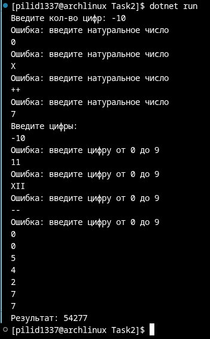

# Абдульманов Алмаз КМБ-1 Лабораторная №2

# Задание 1

## Задача 13

### Текст задачи

На основе списка, содержащего цифры от 1 до 9, получить список из их римских
обозначений.

### Алгоритм решения

Считываем список цифр заданной длинны. Создаём новый список, применив к каждому элементу исходного списка функцию, устанавливающую соответствие между десятичной цифрой и римской цифрой

### Тестирование

# Задание 2

## Задача 13

### Текст задачи

Список содержит десятичные цифры. Составить из них число.

### Алгоритм решения

Считываем список цифр заданной длинны. Составляем из них число, перемножая то, что уже обработали, на 10 и добавляя обрабатываемый элемент (acc = acc * 10 + x)

### Тестирование

